# [📈 Live Status](https://dsbaus.github.io/cdr-uptime): <!--live status--> **🟧 Partial outage**

This repository contains the open-source uptime monitor and status page for [Data Standards Body Australia](https://dsbaus.github.io/cdr-uptime).
[**Visit the status website →**](https://dsbaus.github.io/cdr-uptime)

<!--start: status pages-->
<!-- This summary is generated by Upptime (https://github.com/upptime/upptime) -->
<!-- Do not edit this manually, your changes will be overwritten -->
<!-- prettier-ignore -->
| URL | Status | History | Response Time | Uptime |
| --- | ------ | ------- | ------------- | ------ |
|  [1st Energy](https://public.cdr.1stenergy.com.au/cds-au/v1/energy/plans) | 🟥 Down | [1st-energy.yml](https://github.com/dsbaus/cdr-uptime/commits/HEAD/history/1st-energy.yml) | 

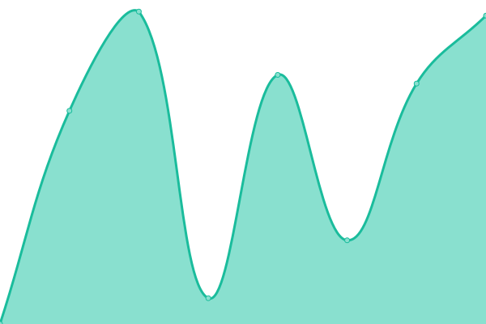 2372ms
     
 | 

<a href="https://dsbaus.github.io/cdr-uptime/history/1st-energy">100.00%</a>
    

|  [ActewAGL](https://public.cdr.actewagl.com.au/cds-au/v1/energy/plans) | 🟥 Down | [actew-agl.yml](https://github.com/dsbaus/cdr-uptime/commits/HEAD/history/actew-agl.yml) | 

 794ms
     
 | 

<a href="https://dsbaus.github.io/cdr-uptime/history/actew-agl">100.00%</a>
    

|  [Active Utilities Retail](https://cdr.energymadeeasy.gov.au/active-utilities/cds-au/v1/energy/plans) | 🟩 Up | [active-utilities-retail.yml](https://github.com/dsbaus/cdr-uptime/commits/HEAD/history/active-utilities-retail.yml) | 

 2780ms
     
 | 

<a href="https://dsbaus.github.io/cdr-uptime/history/active-utilities-retail">100.00%</a>
    

|  [Adelaide Bank](https://api.cdr.adelaidebank.com.au/cds-au/v1/discovery/status) | 🟩 Up | [adelaide-bank.yml](https://github.com/dsbaus/cdr-uptime/commits/HEAD/history/adelaide-bank.yml) | 

 1730ms
     
 | 

<a href="https://dsbaus.github.io/cdr-uptime/history/adelaide-bank">100.00%</a>
    

|  [AGL](https://public.cdr.agl.com.au/cds-au/v1/energy/plans) | 🟥 Down | [agl.yml](https://github.com/dsbaus/cdr-uptime/commits/HEAD/history/agl.yml) | 

 781ms
     
 | 

<a href="https://dsbaus.github.io/cdr-uptime/history/agl">100.00%</a>
    

|  [Alex Bank](https://public.cdr.alex.bank/cds-au/v1/discovery/status) | 🟩 Up | [alex-bank.yml](https://github.com/dsbaus/cdr-uptime/commits/HEAD/history/alex-bank.yml) | 

 886ms
     
 | 

<a href="https://dsbaus.github.io/cdr-uptime/history/alex-bank">100.00%</a>
    

|  [Alinta Energy](https://public.cdr.alintaenergy.com.au/cds-au/v1/energy/plans) | 🟥 Down | [alinta-energy.yml](https://github.com/dsbaus/cdr-uptime/commits/HEAD/history/alinta-energy.yml) | 

 815ms
     
 | 

<a href="https://dsbaus.github.io/cdr-uptime/history/alinta-energy">100.00%</a>
    

|  [Altogether](https://cdr.energymadeeasy.gov.au/altogether/cds-au/v1/energy/plans) | 🟩 Up | [altogether.yml](https://github.com/dsbaus/cdr-uptime/commits/HEAD/history/altogether.yml) | 

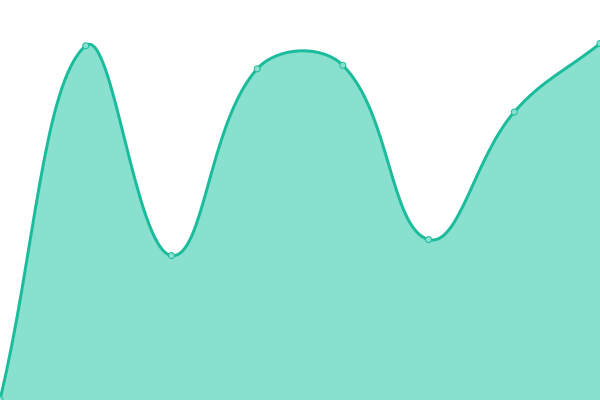 688ms
     
 | 

<a href="https://dsbaus.github.io/cdr-uptime/history/altogether">100.00%</a>
    

|  [Amber Electric](https://cdr.energymadeeasy.gov.au/amber/cds-au/v1/energy/plans) | 🟩 Up | [amber-electric.yml](https://github.com/dsbaus/cdr-uptime/commits/HEAD/history/amber-electric.yml) | 

 797ms
     
 | 

<a href="https://dsbaus.github.io/cdr-uptime/history/amber-electric">100.00%</a>
    

|  [AMP Bank](https://api.cdr-api.amp.com.au/cds-au/v1/discovery/status) | 🟩 Up | [amp-bank.yml](https://github.com/dsbaus/cdr-uptime/commits/HEAD/history/amp-bank.yml) | 

 936ms
     
 | 

<a href="https://dsbaus.github.io/cdr-uptime/history/amp-bank">100.00%</a>
    

|  [Ampol Energy](https://cdr.energymadeeasy.gov.au/ampol/cds-au/v1/energy/plans) | 🟩 Up | [ampol-energy.yml](https://github.com/dsbaus/cdr-uptime/commits/HEAD/history/ampol-energy.yml) | 

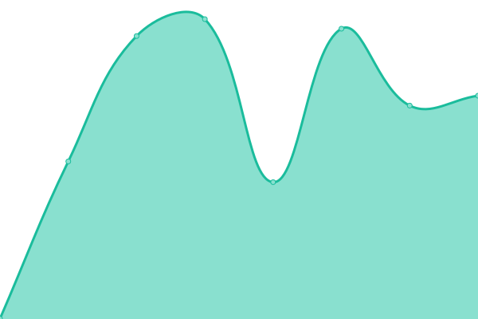 793ms
     
 | 

<a href="https://dsbaus.github.io/cdr-uptime/history/ampol-energy">100.00%</a>
    

|  [ANZ](https://api.anz/cds-au/v1/discovery/status) | 🟩 Up | [anz.yml](https://github.com/dsbaus/cdr-uptime/commits/HEAD/history/anz.yml) | 

 2083ms
     
 | 

<a href="https://dsbaus.github.io/cdr-uptime/history/anz">100.00%</a>
    

|  [ANZ Plus](https://cdr.apix.anz/cds-au/v1/discovery/status) | 🟩 Up | [anz-plus.yml](https://github.com/dsbaus/cdr-uptime/commits/HEAD/history/anz-plus.yml) | 

 621ms
     
 | 

<a href="https://dsbaus.github.io/cdr-uptime/history/anz-plus">100.00%</a>
    

|  [Arab Bank Australia Limited](https://public.cdr.arabbank.com.au/cds-au/v1/discovery/status) | 🟩 Up | [arab-bank-australia-limited.yml](https://github.com/dsbaus/cdr-uptime/commits/HEAD/history/arab-bank-australia-limited.yml) | 

 1321ms
     
 | 

<a href="https://dsbaus.github.io/cdr-uptime/history/arab-bank-australia-limited">100.00%</a>
    

|  [Arc Energy Group](https://cdr.energymadeeasy.gov.au/arc-energy/cds-au/v1/energy/plans) | 🟩 Up | [arc-energy-group.yml](https://github.com/dsbaus/cdr-uptime/commits/HEAD/history/arc-energy-group.yml) | 

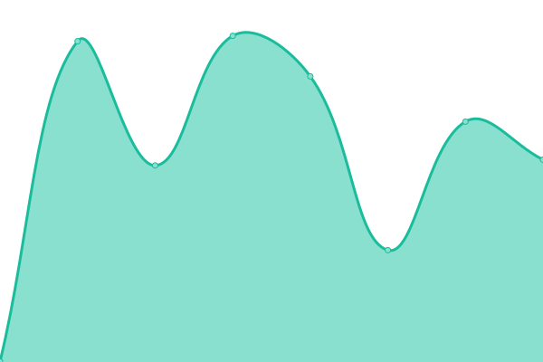 865ms
     
 | 

<a href="https://dsbaus.github.io/cdr-uptime/history/arc-energy-group">100.00%</a>
    

|  [ARCLINE by RACV](https://cdr.energymadeeasy.gov.au/arcline/cds-au/v1/energy/plans) | 🟩 Up | [arcline-by-racv.yml](https://github.com/dsbaus/cdr-uptime/commits/HEAD/history/arcline-by-racv.yml) | 

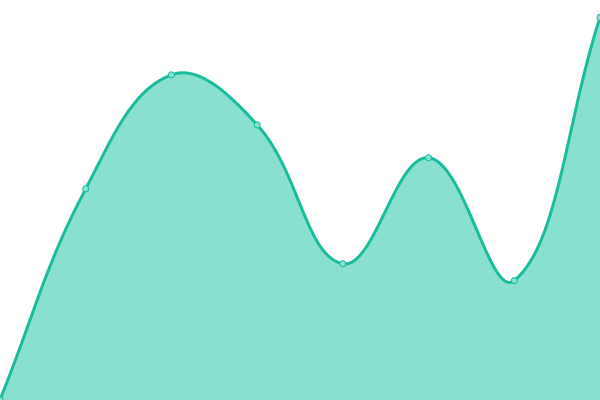 959ms
     
 | 

<a href="https://dsbaus.github.io/cdr-uptime/history/arcline-by-racv">100.00%</a>
    

|  [Arcstream](https://cdr.energymadeeasy.gov.au/arcstream/cds-au/v1/energy/plans) | 🟩 Up | [arcstream.yml](https://github.com/dsbaus/cdr-uptime/commits/HEAD/history/arcstream.yml) | 

 642ms
     
 | 

<a href="https://dsbaus.github.io/cdr-uptime/history/arcstream">100.00%</a>
    

|  [Aurora Energy](https://cdr.energymadeeasy.gov.au/aurora/cds-au/v1/energy/plans) | 🟩 Up | [aurora-energy.yml](https://github.com/dsbaus/cdr-uptime/commits/HEAD/history/aurora-energy.yml) | 

 916ms
     
 | 

<a href="https://dsbaus.github.io/cdr-uptime/history/aurora-energy">100.00%</a>
    

|  [Aussie Home Loans](https://aussie.openportal.com.au/cds-au/v1/discovery/status) | 🟩 Up | [aussie-home-loans.yml](https://github.com/dsbaus/cdr-uptime/commits/HEAD/history/aussie-home-loans.yml) | 

 1440ms
     
 | 

<a href="https://dsbaus.github.io/cdr-uptime/history/aussie-home-loans">100.00%</a>
    

|  [Australian Military Bank](https://public.open.australianmilitarybank.com.au/cds-au/v1/discovery/status) | 🟩 Up | [australian-military-bank.yml](https://github.com/dsbaus/cdr-uptime/commits/HEAD/history/australian-military-bank.yml) | 

 958ms
     
 | 

<a href="https://dsbaus.github.io/cdr-uptime/history/australian-military-bank">100.00%</a>
    

|  [Australian Mutual Bank LTD](https://internetbanking.australianmutual.bank/openbanking/cds-au/v1/discovery/status) | 🟩 Up | [australian-mutual-bank-ltd.yml](https://github.com/dsbaus/cdr-uptime/commits/HEAD/history/australian-mutual-bank-ltd.yml) | 

 1123ms
     
 | 

<a href="https://dsbaus.github.io/cdr-uptime/history/australian-mutual-bank-ltd">100.00%</a>
    

|  [Australian Unity Bank](https://open-banking.australianunity.com.au/cds-au/v1/discovery/status) | 🟩 Up | [australian-unity-bank.yml](https://github.com/dsbaus/cdr-uptime/commits/HEAD/history/australian-unity-bank.yml) | 

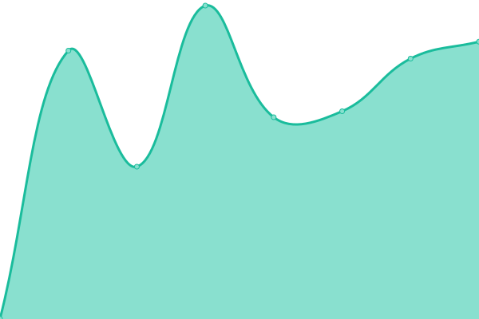 1154ms
     
 | 

<a href="https://dsbaus.github.io/cdr-uptime/history/australian-unity-bank">100.00%</a>
    

|  [Auswide Bank Ltd](https://api.auswidebank.com.au/openbanking/cds-au/v1/discovery/status) | 🟩 Up | [auswide-bank-ltd.yml](https://github.com/dsbaus/cdr-uptime/commits/HEAD/history/auswide-bank-ltd.yml) | 

 1838ms
     
 | 

<a href="https://dsbaus.github.io/cdr-uptime/history/auswide-bank-ltd">100.00%</a>
    

|  [AWA Alliance Bank](https://api.cdr.awaalliancebank.com.au/cds-au/v1/discovery/status) | 🟥 Down | [awa-alliance-bank.yml](https://github.com/dsbaus/cdr-uptime/commits/HEAD/history/awa-alliance-bank.yml) | 

 0ms
     
 | 

<a href="https://dsbaus.github.io/cdr-uptime/history/awa-alliance-bank">100.00%</a>
    

|  [Bank Australia](https://public.cdr-api.bankaust.com.au/cds-au/v1/discovery/status) | 🟩 Up | [bank-australia.yml](https://github.com/dsbaus/cdr-uptime/commits/HEAD/history/bank-australia.yml) | 

 1888ms
     
 | 

<a href="https://dsbaus.github.io/cdr-uptime/history/bank-australia">100.00%</a>
    

|  [Bank First](https://public.cdr.bankfirst.com.au/cds-au/v1/discovery/status) | 🟩 Up | [bank-first.yml](https://github.com/dsbaus/cdr-uptime/commits/HEAD/history/bank-first.yml) | 

 727ms
     
 | 

<a href="https://dsbaus.github.io/cdr-uptime/history/bank-first">100.00%</a>
    

|  [Bank of China](https://api-gateway.bankofchina.com.au/cds-au/v1/discovery/status) | 🟩 Up | [bank-of-china.yml](https://github.com/dsbaus/cdr-uptime/commits/HEAD/history/bank-of-china.yml) | 

 1477ms
     
 | 

<a href="https://dsbaus.github.io/cdr-uptime/history/bank-of-china">100.00%</a>
    

|  [Bank of Melbourne](https://digital-api.bankofmelbourne.com.au/cds-au/v1/discovery/status) | 🟩 Up | [bank-of-melbourne.yml](https://github.com/dsbaus/cdr-uptime/commits/HEAD/history/bank-of-melbourne.yml) | 

 6312ms
     
 | 

<a href="https://dsbaus.github.io/cdr-uptime/history/bank-of-melbourne">100.00%</a>
    

|  [Bank of Queensland Limited](https://api.cds.boq.com.au/cds-au/v1/discovery/status) | 🟩 Up | [bank-of-queensland-limited.yml](https://github.com/dsbaus/cdr-uptime/commits/HEAD/history/bank-of-queensland-limited.yml) | 

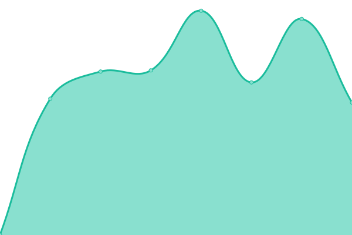 1195ms
     
 | 

<a href="https://dsbaus.github.io/cdr-uptime/history/bank-of-queensland-limited">100.00%</a>
    

|  [Bank of Sydney](https://openbank.api.banksyd.com.au/cds-au/v1/discovery/status) | 🟩 Up | [bank-of-sydney.yml](https://github.com/dsbaus/cdr-uptime/commits/HEAD/history/bank-of-sydney.yml) | 

 1047ms
     
 | 

<a href="https://dsbaus.github.io/cdr-uptime/history/bank-of-sydney">100.00%</a>
    

|  [Bank of us](https://api.bankofus.com.au/OpenBanking/cds-au/v1/discovery/status) | 🟩 Up | [bank-of-us.yml](https://github.com/dsbaus/cdr-uptime/commits/HEAD/history/bank-of-us.yml) | 

 993ms
     
 | 

<a href="https://dsbaus.github.io/cdr-uptime/history/bank-of-us">100.00%</a>
    

|  [BankSA](https://digital-api.banksa.com.au/cds-au/v1/discovery/status) | 🟩 Up | [bank-sa.yml](https://github.com/dsbaus/cdr-uptime/commits/HEAD/history/bank-sa.yml) | 

 4205ms
     
 | 

<a href="https://dsbaus.github.io/cdr-uptime/history/bank-sa">100.00%</a>
    

|  [BankVic](https://ib.bankvic.com.au/openbanking/cds-au/v1/discovery/status) | 🟩 Up | [bank-vic.yml](https://github.com/dsbaus/cdr-uptime/commits/HEAD/history/bank-vic.yml) | 

 1396ms
     
 | 

<a href="https://dsbaus.github.io/cdr-uptime/history/bank-vic">100.00%</a>
    

|  [bankWAW](https://onlinebanking.wawcu.com.au/OpenBanking/cds-au/v1/discovery/status) | 🟩 Up | [bank-waw.yml](https://github.com/dsbaus/cdr-uptime/commits/HEAD/history/bank-waw.yml) | 

 1060ms
     
 | 

<a href="https://dsbaus.github.io/cdr-uptime/history/bank-waw">100.00%</a>
    

|  [Bankwest](https://open-api.bankwest.com.au/bwpublic/cds-au/v1/discovery/status) | 🟩 Up | [bankwest.yml](https://github.com/dsbaus/cdr-uptime/commits/HEAD/history/bankwest.yml) | 

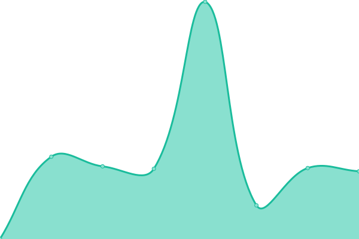 1822ms
     
 | 

<a href="https://dsbaus.github.io/cdr-uptime/history/bankwest">100.00%</a>
    

|  [BCU Bank](https://public.cdr-api.bcu.com.au/cds-au/v1/discovery/status) | 🟩 Up | [bcu-bank.yml](https://github.com/dsbaus/cdr-uptime/commits/HEAD/history/bcu-bank.yml) | 

 1264ms
     
 | 

<a href="https://dsbaus.github.io/cdr-uptime/history/bcu-bank">100.00%</a>
    

|  [Bell Potter](https://bellpotter.openportal.com.au/cds-au/v1/discovery/status) | 🟩 Up | [bell-potter.yml](https://github.com/dsbaus/cdr-uptime/commits/HEAD/history/bell-potter.yml) | 

 2312ms
     
 | 

<a href="https://dsbaus.github.io/cdr-uptime/history/bell-potter">100.00%</a>
    

|  [Bendigo Bank](https://api.cdr.bendigobank.com.au/cds-au/v1/discovery/status) | 🟩 Up | [bendigo-bank.yml](https://github.com/dsbaus/cdr-uptime/commits/HEAD/history/bendigo-bank.yml) | 

 1010ms
     
 | 

<a href="https://dsbaus.github.io/cdr-uptime/history/bendigo-bank">100.00%</a>
    

|  [Besy](https://cdr.energymadeeasy.gov.au/besy/cds-au/v1/energy/plans) | 🟩 Up | [besy.yml](https://github.com/dsbaus/cdr-uptime/commits/HEAD/history/besy.yml) | 

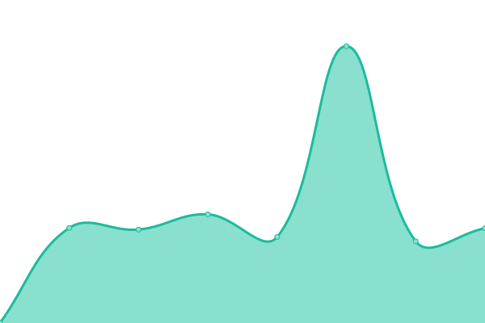 856ms
     
 | 

<a href="https://dsbaus.github.io/cdr-uptime/history/besy">100.00%</a>
    

|  [Beyond Bank Australia](https://public.cdr.api.beyondbank.com.au/cds-au/v1/discovery/status) | 🟩 Up | [beyond-bank-australia.yml](https://github.com/dsbaus/cdr-uptime/commits/HEAD/history/beyond-bank-australia.yml) | 

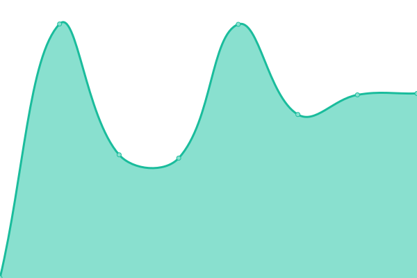 1316ms
     
 | 

<a href="https://dsbaus.github.io/cdr-uptime/history/beyond-bank-australia">100.00%</a>
    

|  [BHCCU](https://public.cdr-api.bhccu.com.au/cds-au/v1/discovery/status) | 🟩 Up | [bhccu.yml](https://github.com/dsbaus/cdr-uptime/commits/HEAD/history/bhccu.yml) | 

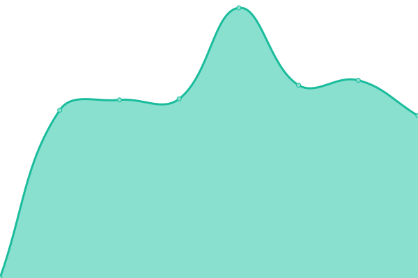 1169ms
     
 | 

<a href="https://dsbaus.github.io/cdr-uptime/history/bhccu">100.00%</a>
    

|  [Blue NRG](https://public.cdr.bluenrg.com.au/cds-au/v1/energy/plans) | 🟥 Down | [blue-nrg.yml](https://github.com/dsbaus/cdr-uptime/commits/HEAD/history/blue-nrg.yml) | 

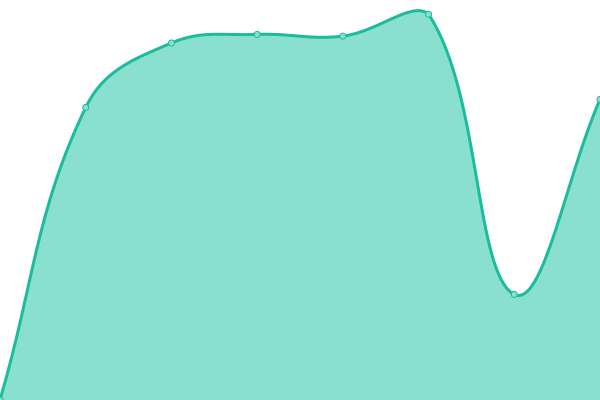 2780ms
     
 | 

<a href="https://dsbaus.github.io/cdr-uptime/history/blue-nrg">100.00%</a>
    

|  [BOQ Specialist](https://api.cds.boqspecialist.com.au/cds-au/v1/discovery/status) | 🟩 Up | [boq-specialist.yml](https://github.com/dsbaus/cdr-uptime/commits/HEAD/history/boq-specialist.yml) | 

 1026ms
     
 | 

<a href="https://dsbaus.github.io/cdr-uptime/history/boq-specialist">100.00%</a>
    

|  [Brighte Energy](https://cdr.energymadeeasy.gov.au/brighte/cds-au/v1/energy/plans) | 🟩 Up | [brighte-energy.yml](https://github.com/dsbaus/cdr-uptime/commits/HEAD/history/brighte-energy.yml) | 

 753ms
     
 | 

<a href="https://dsbaus.github.io/cdr-uptime/history/brighte-energy">100.00%</a>
    

|  [Cairns bank](https://openbanking.cairnsbank.com.au/OpenBanking/cds-au/v1/discovery/status) | 🟩 Up | [cairns-bank.yml](https://github.com/dsbaus/cdr-uptime/commits/HEAD/history/cairns-bank.yml) | 

 1155ms
     
 | 

<a href="https://dsbaus.github.io/cdr-uptime/history/cairns-bank">100.00%</a>
    

|  [Card Services](https://api.openbanking.cardservicesdirect.com.au/cds-au/v1/discovery/status) | 🟩 Up | [card-services.yml](https://github.com/dsbaus/cdr-uptime/commits/HEAD/history/card-services.yml) | 

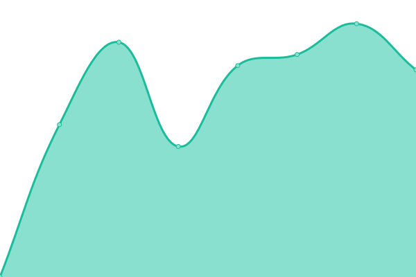 1923ms
     
 | 

<a href="https://dsbaus.github.io/cdr-uptime/history/card-services">100.00%</a>
    

|  [CBA - CommBiz](https://cdr.commbiz.api.commbank.com.au/cbzpublic/cds-au/v1/discovery/status) | 🟩 Up | [cba-comm-biz.yml](https://github.com/dsbaus/cdr-uptime/commits/HEAD/history/cba-comm-biz.yml) | 

 1325ms
     
 | 

<a href="https://dsbaus.github.io/cdr-uptime/history/cba-comm-biz">100.00%</a>
    

|  [Central Murray Credit Union Limited](https://secure.cmcu.com.au/openbanking/cds-au/v1/discovery/status) | 🟩 Up | [central-murray-credit-union-limited.yml](https://github.com/dsbaus/cdr-uptime/commits/HEAD/history/central-murray-credit-union-limited.yml) | 

 1121ms
     
 | 

<a href="https://dsbaus.github.io/cdr-uptime/history/central-murray-credit-union-limited">100.00%</a>
    

|  [Central West CUL](https://ib.cwcu.com.au/openbanking/cds-au/v1/discovery/status) | 🟩 Up | [central-west-cul.yml](https://github.com/dsbaus/cdr-uptime/commits/HEAD/history/central-west-cul.yml) | 

 919ms
     
 | 

<a href="https://dsbaus.github.io/cdr-uptime/history/central-west-cul">100.00%</a>
    

|  [Circular Energy](https://cdr.energymadeeasy.gov.au/circular/cds-au/v1/energy/plans) | 🟩 Up | [circular-energy.yml](https://github.com/dsbaus/cdr-uptime/commits/HEAD/history/circular-energy.yml) | 

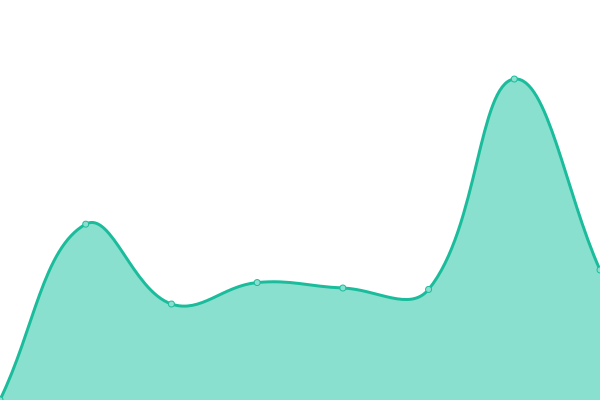 684ms
     
 | 

<a href="https://dsbaus.github.io/cdr-uptime/history/circular-energy">100.00%</a>
    

|  [Citi](https://openbanking.api.citi.com.au/cds-au/v1/discovery/status) | 🟩 Up | [citi.yml](https://github.com/dsbaus/cdr-uptime/commits/HEAD/history/citi.yml) | 

 1510ms
     
 | 

<a href="https://dsbaus.github.io/cdr-uptime/history/citi">100.00%</a>
    

|  [CleanCo Queensland](https://cdr.energymadeeasy.gov.au/cleanco/cds-au/v1/energy/plans) | 🟩 Up | [clean-co-queensland.yml](https://github.com/dsbaus/cdr-uptime/commits/HEAD/history/clean-co-queensland.yml) | 

 619ms
     
 | 

<a href="https://dsbaus.github.io/cdr-uptime/history/clean-co-queensland">100.00%</a>
    

|  [CleanPeak Energy Retail](https://cdr.energymadeeasy.gov.au/cleanpeak/cds-au/v1/energy/plans) | 🟩 Up | [clean-peak-energy-retail.yml](https://github.com/dsbaus/cdr-uptime/commits/HEAD/history/clean-peak-energy-retail.yml) | 

 563ms
     
 | 

<a href="https://dsbaus.github.io/cdr-uptime/history/clean-peak-energy-retail">100.00%</a>
    

|  [Coastline Credit Union](https://public.cdr-api.coastline.com.au/cds-au/v1/discovery/status) | 🟩 Up | [coastline-credit-union.yml](https://github.com/dsbaus/cdr-uptime/commits/HEAD/history/coastline-credit-union.yml) | 

 2583ms
     
 | 

<a href="https://dsbaus.github.io/cdr-uptime/history/coastline-credit-union">100.00%</a>
    

|  [Coles Energy](https://cdr.energymadeeasy.gov.au/coles/cds-au/v1/energy/plans) | 🟩 Up | [coles-energy.yml](https://github.com/dsbaus/cdr-uptime/commits/HEAD/history/coles-energy.yml) | 

 482ms
     
 | 

<a href="https://dsbaus.github.io/cdr-uptime/history/coles-energy">100.00%</a>
    

|  [Coles Financial Services](https://api.openbanking.secure.coles.com.au/cds-au/v1/discovery/status) | 🟩 Up | [coles-financial-services.yml](https://github.com/dsbaus/cdr-uptime/commits/HEAD/history/coles-financial-services.yml) | 

 2042ms
     
 | 

<a href="https://dsbaus.github.io/cdr-uptime/history/coles-financial-services">100.00%</a>
    

|  [Commander Power & Gas](https://cdr.energymadeeasy.gov.au/commander/cds-au/v1/energy/plans) | 🟩 Up | [commander-power-and-gas.yml](https://github.com/dsbaus/cdr-uptime/commits/HEAD/history/commander-power-and-gas.yml) | 

 638ms
     
 | 

<a href="https://dsbaus.github.io/cdr-uptime/history/commander-power-and-gas">100.00%</a>
    

|  [CommBank](https://api.commbank.com.au/public/cds-au/v1/discovery/status) | 🟩 Up | [comm-bank.yml](https://github.com/dsbaus/cdr-uptime/commits/HEAD/history/comm-bank.yml) | 

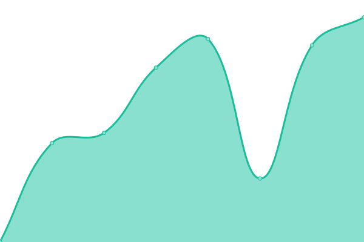 1076ms
     
 | 

<a href="https://dsbaus.github.io/cdr-uptime/history/comm-bank">100.00%</a>
    

|  [CommFCU](https://netbank.communityfirst.com.au/cf-OpenBanking/cds-au/v1/discovery/status) | 🟩 Up | [comm-fcu.yml](https://github.com/dsbaus/cdr-uptime/commits/HEAD/history/comm-fcu.yml) | 

 1970ms
     
 | 

<a href="https://dsbaus.github.io/cdr-uptime/history/comm-fcu">100.00%</a>
    

|  [COVAU PTY LIMITED](https://public.cdr.covau.com.au/cds-au/v1/energy/plans) | 🟥 Down | [covau-pty-limited.yml](https://github.com/dsbaus/cdr-uptime/commits/HEAD/history/covau-pty-limited.yml) | 

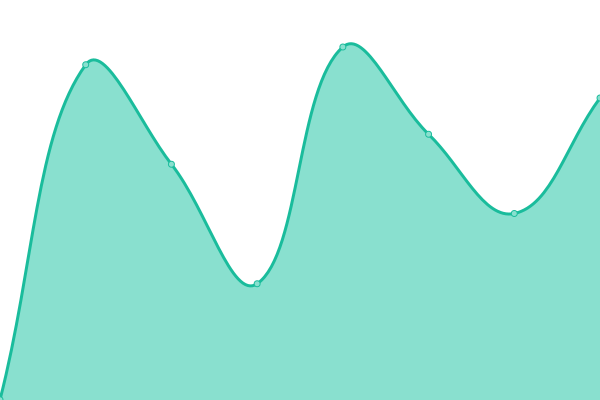 1167ms
     
 | 

<a href="https://dsbaus.github.io/cdr-uptime/history/covau-pty-limited">100.00%</a>
    

|  [CPE Mascot](https://cdr.energymadeeasy.gov.au/cpe-mascot/cds-au/v1/energy/plans) | 🟩 Up | [cpe-mascot.yml](https://github.com/dsbaus/cdr-uptime/commits/HEAD/history/cpe-mascot.yml) | 

 604ms
     
 | 

<a href="https://dsbaus.github.io/cdr-uptime/history/cpe-mascot">100.00%</a>
    

|  [Credit Union SA](https://openbanking.api.creditunionsa.com.au/cds-au/v1/discovery/status) | 🟩 Up | [credit-union-sa.yml](https://github.com/dsbaus/cdr-uptime/commits/HEAD/history/credit-union-sa.yml) | 

 1076ms
     
 | 

<a href="https://dsbaus.github.io/cdr-uptime/history/credit-union-sa">100.00%</a>
    

|  [DDH Graham](https://api.cds.ddhgraham.com.au/cds-au/v1/discovery/status) | 🟩 Up | [ddh-graham.yml](https://github.com/dsbaus/cdr-uptime/commits/HEAD/history/ddh-graham.yml) | 

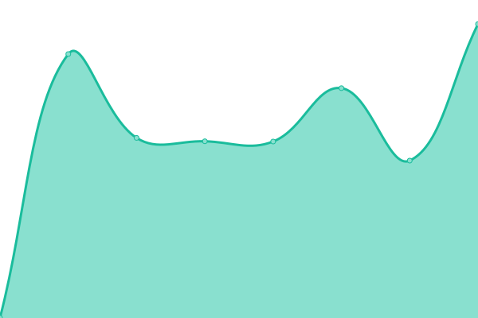 1293ms
     
 | 

<a href="https://dsbaus.github.io/cdr-uptime/history/ddh-graham">100.00%</a>
    

|  [Defence Bank](https://product.defencebank.com.au/cds-au/v1/discovery/status) | 🟥 Down | [defence-bank.yml](https://github.com/dsbaus/cdr-uptime/commits/HEAD/history/defence-bank.yml) | 

 0ms
     
 | 

<a href="https://dsbaus.github.io/cdr-uptime/history/defence-bank">0.00%</a>
    

|  [Diamond Energy](https://cdr.diamondenergy.com.au:18101/cds-au/v1/energy/plans) | 🟩 Up | [diamond-energy.yml](https://github.com/dsbaus/cdr-uptime/commits/HEAD/history/diamond-energy.yml) | 

 1604ms
     
 | 

<a href="https://dsbaus.github.io/cdr-uptime/history/diamond-energy">100.00%</a>
    

|  [Discover Energy](https://cdr.energymadeeasy.gov.au/discover/cds-au/v1/energy/plans) | 🟩 Up | [discover-energy.yml](https://github.com/dsbaus/cdr-uptime/commits/HEAD/history/discover-energy.yml) | 

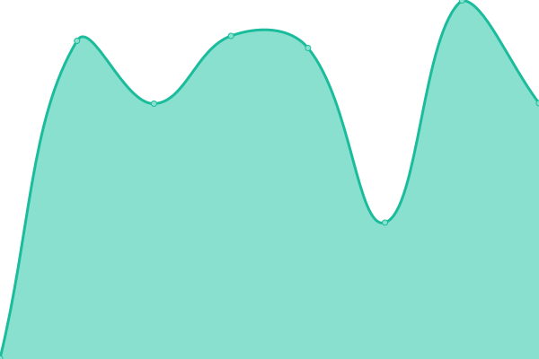 604ms
     
 | 

<a href="https://dsbaus.github.io/cdr-uptime/history/discover-energy">100.00%</a>
    

|  [Dnister](https://public.cdr-api.dnister.com.au/cds-au/v1/discovery/status) | 🟩 Up | [dnister.yml](https://github.com/dsbaus/cdr-uptime/commits/HEAD/history/dnister.yml) | 

 1743ms
     
 | 

<a href="https://dsbaus.github.io/cdr-uptime/history/dnister">100.00%</a>
    

|  [Dodo Power & Gas](https://public.cdr.dodo.com/cds-au/v1/energy/plans) | 🟥 Down | [dodo-power-and-gas.yml](https://github.com/dsbaus/cdr-uptime/commits/HEAD/history/dodo-power-and-gas.yml) | 

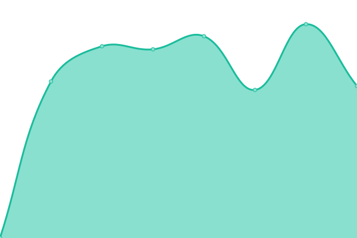 936ms
     
 | 

<a href="https://dsbaus.github.io/cdr-uptime/history/dodo-power-and-gas">100.00%</a>
    

|  [EA Connect](https://cdr.energymadeeasy.gov.au/ea-connect/cds-au/v1/energy/plans) | 🟩 Up | [ea-connect.yml](https://github.com/dsbaus/cdr-uptime/commits/HEAD/history/ea-connect.yml) | 

 602ms
     
 | 

<a href="https://dsbaus.github.io/cdr-uptime/history/ea-connect">100.00%</a>
    

|  [Easy Street](https://ebranch.easystreet.com.au/es-OpenBanking/cds-au/v1/discovery/status) | 🟩 Up | [easy-street.yml](https://github.com/dsbaus/cdr-uptime/commits/HEAD/history/easy-street.yml) | 

 1397ms
     
 | 

<a href="https://dsbaus.github.io/cdr-uptime/history/easy-street">100.00%</a>
    

|  [Electricity in a Box](https://cdr.energymadeeasy.gov.au/electricity-in-a-box/cds-au/v1/energy/plans) | 🟩 Up | [electricity-in-a-box.yml](https://github.com/dsbaus/cdr-uptime/commits/HEAD/history/electricity-in-a-box.yml) | 

 0ms
     
 | 

<a href="https://dsbaus.github.io/cdr-uptime/history/electricity-in-a-box">100.00%</a>
    

|  [Energy Locals](https://cdr.energymadeeasy.gov.au/energy-locals/cds-au/v1/energy/plans) | 🟩 Up | [energy-locals.yml](https://github.com/dsbaus/cdr-uptime/commits/HEAD/history/energy-locals.yml) | 

 993ms
     
 | 

<a href="https://dsbaus.github.io/cdr-uptime/history/energy-locals">100.00%</a>
    

|  [EnergyAustralia](https://authncdr.energyaustralia.com.au/cds-au/v1/energy/plans) | 🟥 Down | [energy-australia.yml](https://github.com/dsbaus/cdr-uptime/commits/HEAD/history/energy-australia.yml) | 

 771ms
     
 | 

<a href="https://dsbaus.github.io/cdr-uptime/history/energy-australia">100.00%</a>
    

|  [ENGIE](https://public.cdr.simplyenergy.com.au/cds-au/v1/energy/plans) | 🟥 Down | [engie.yml](https://github.com/dsbaus/cdr-uptime/commits/HEAD/history/engie.yml) | 

 706ms
     
 | 

<a href="https://dsbaus.github.io/cdr-uptime/history/engie">100.00%</a>
    

|  [ENGIE large business](https://public-cdr-engie.bravecloud.com/b1swktl2zamng9xf/public/cds-au/v1/energy/plans) | 🟥 Down | [engie-large-business.yml](https://github.com/dsbaus/cdr-uptime/commits/HEAD/history/engie-large-business.yml) | 

 1103ms
     
 | 

<a href="https://dsbaus.github.io/cdr-uptime/history/engie-large-business">100.00%</a>
    

|  [Ergon Energy Retail](https://public.cdr.ergonretail.com.au/cds-au/v1/energy/plans) | 🟥 Down | [ergon-energy-retail.yml](https://github.com/dsbaus/cdr-uptime/commits/HEAD/history/ergon-energy-retail.yml) | 

 1008ms
     
 | 

<a href="https://dsbaus.github.io/cdr-uptime/history/ergon-energy-retail">100.00%</a>
    

|  [ERM Power](https://cdr.energymadeeasy.gov.au/erm-power/cds-au/v1/energy/plans) | 🟩 Up | [erm-power.yml](https://github.com/dsbaus/cdr-uptime/commits/HEAD/history/erm-power.yml) | 

 815ms
     
 | 

<a href="https://dsbaus.github.io/cdr-uptime/history/erm-power">100.00%</a>
    

|  [Evergy](https://cdr.energymadeeasy.gov.au/evergy/cds-au/v1/energy/plans) | 🟩 Up | [evergy.yml](https://github.com/dsbaus/cdr-uptime/commits/HEAD/history/evergy.yml) | 

 647ms
     
 | 

<a href="https://dsbaus.github.io/cdr-uptime/history/evergy">100.00%</a>
    

|  [Family First](https://public.cdr.familyfirst.com.au/cds-au/v1/discovery/status) | 🟩 Up | [family-first.yml](https://github.com/dsbaus/cdr-uptime/commits/HEAD/history/family-first.yml) | 

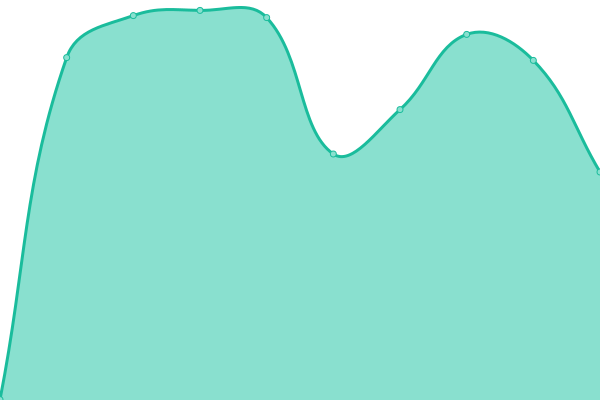 739ms
     
 | 

<a href="https://dsbaus.github.io/cdr-uptime/history/family-first">100.00%</a>
    

|  [Fire Service Credit Union](https://public.cdr-api.fscu.com.au/cds-au/v1/discovery/status) | 🟩 Up | [fire-service-credit-union.yml](https://github.com/dsbaus/cdr-uptime/commits/HEAD/history/fire-service-credit-union.yml) | 

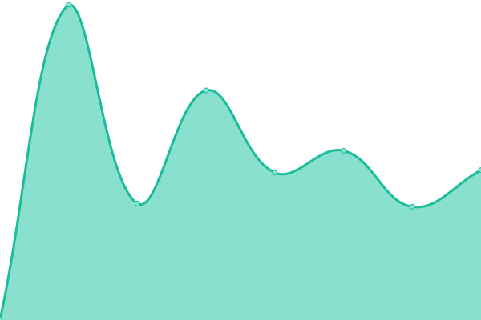 1298ms
     
 | 

<a href="https://dsbaus.github.io/cdr-uptime/history/fire-service-credit-union">100.00%</a>
    

|  [Firefighters Mutual Bank](https://ob.tmbl.com.au/fmbank/cds-au/v1/discovery/status) | 🟩 Up | [firefighters-mutual-bank.yml](https://github.com/dsbaus/cdr-uptime/commits/HEAD/history/firefighters-mutual-bank.yml) | 

 3188ms
     
 | 

<a href="https://dsbaus.github.io/cdr-uptime/history/firefighters-mutual-bank">100.00%</a>
    

|  [First Option Bank](https://internetbanking.firstoption.com.au/OpenBanking/cds-au/v1/discovery/status) | 🟩 Up | [first-option-bank.yml](https://github.com/dsbaus/cdr-uptime/commits/HEAD/history/first-option-bank.yml) | 

 898ms
     
 | 

<a href="https://dsbaus.github.io/cdr-uptime/history/first-option-bank">100.00%</a>
    

|  [Flow Power](https://cdr.energymadeeasy.gov.au/flow-power/cds-au/v1/energy/plans) | 🟩 Up | [flow-power.yml](https://github.com/dsbaus/cdr-uptime/commits/HEAD/history/flow-power.yml) | 

 741ms
     
 | 

<a href="https://dsbaus.github.io/cdr-uptime/history/flow-power">100.00%</a>
    

|  [Flow Systems](https://cdr.energymadeeasy.gov.au/flow-systems/cds-au/v1/energy/plans) | 🟩 Up | [flow-systems.yml](https://github.com/dsbaus/cdr-uptime/commits/HEAD/history/flow-systems.yml) | 

 604ms
     
 | 

<a href="https://dsbaus.github.io/cdr-uptime/history/flow-systems">100.00%</a>
    

|  [Future X Power](https://cdr.energymadeeasy.gov.au/future-x/cds-au/v1/energy/plans) | 🟩 Up | [future-x-power.yml](https://github.com/dsbaus/cdr-uptime/commits/HEAD/history/future-x-power.yml) | 

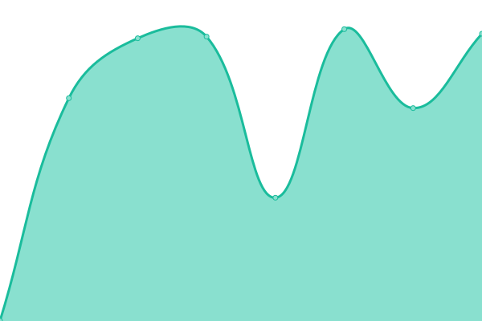 955ms
     
 | 

<a href="https://dsbaus.github.io/cdr-uptime/history/future-x-power">100.00%</a>
    

|  [G&C Mutual Bank](https://ibank.gcmutualbank.com.au/OpenBanking/cds-au/v1/discovery/status) | 🟩 Up | [g-and-c-mutual-bank.yml](https://github.com/dsbaus/cdr-uptime/commits/HEAD/history/g-and-c-mutual-bank.yml) | 

 1024ms
     
 | 

<a href="https://dsbaus.github.io/cdr-uptime/history/g-and-c-mutual-bank">100.00%</a>
    

|  [Gateway Bank](https://public.cdr-api.gatewaybank.com.au/cds-au/v1/discovery/status) | 🟩 Up | [gateway-bank.yml](https://github.com/dsbaus/cdr-uptime/commits/HEAD/history/gateway-bank.yml) | 

 1133ms
     
 | 

<a href="https://dsbaus.github.io/cdr-uptime/history/gateway-bank">100.00%</a>
    

|  [GEE Energy](https://cdr.energymadeeasy.gov.au/gee-energy/cds-au/v1/energy/plans) | 🟩 Up | [gee-energy.yml](https://github.com/dsbaus/cdr-uptime/commits/HEAD/history/gee-energy.yml) | 

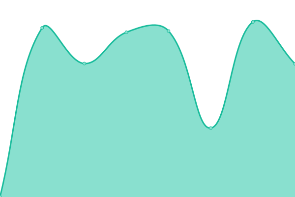 643ms
     
 | 

<a href="https://dsbaus.github.io/cdr-uptime/history/gee-energy">100.00%</a>
    

|  [Geelong Bank](https://online.geelongbank.com.au/OpenBanking/cds-au/v1/discovery/status) | 🟥 Down | [geelong-bank.yml](https://github.com/dsbaus/cdr-uptime/commits/HEAD/history/geelong-bank.yml) | 

 3114ms
     
 | 

<a href="https://dsbaus.github.io/cdr-uptime/history/geelong-bank">14.23%</a>
    

|  [GloBird Energy](https://publiccdr.globirdenergy.com.au/cds-au/v1/energy/plans) | 🟩 Up | [glo-bird-energy.yml](https://github.com/dsbaus/cdr-uptime/commits/HEAD/history/glo-bird-energy.yml) | 

 1517ms
     
 | 

<a href="https://dsbaus.github.io/cdr-uptime/history/glo-bird-energy">100.00%</a>
    

|  [Glow Power](https://cdr.energymadeeasy.gov.au/glow-power/cds-au/v1/energy/plans) | 🟩 Up | [glow-power.yml](https://github.com/dsbaus/cdr-uptime/commits/HEAD/history/glow-power.yml) | 

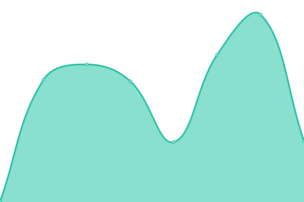 666ms
     
 | 

<a href="https://dsbaus.github.io/cdr-uptime/history/glow-power">100.00%</a>
    

|  [gmcu](https://secure.gmcu.com.au/OpenBanking/cds-au/v1/discovery/status) | 🟩 Up | [gmcu.yml](https://github.com/dsbaus/cdr-uptime/commits/HEAD/history/gmcu.yml) | 

 1933ms
     
 | 

<a href="https://dsbaus.github.io/cdr-uptime/history/gmcu">100.00%</a>
    

|  [Goldfields Money](https://prd.bnk.com.au/cds-au/v1/discovery/status) | 🟩 Up | [goldfields-money.yml](https://github.com/dsbaus/cdr-uptime/commits/HEAD/history/goldfields-money.yml) | 

 1326ms
     
 | 

<a href="https://dsbaus.github.io/cdr-uptime/history/goldfields-money">100.00%</a>
    

|  [Great Southern Bank](https://api.open-banking.greatsouthernbank.com.au/cds-au/v1/discovery/status) | 🟩 Up | [great-southern-bank.yml](https://github.com/dsbaus/cdr-uptime/commits/HEAD/history/great-southern-bank.yml) | 

 801ms
     
 | 

<a href="https://dsbaus.github.io/cdr-uptime/history/great-southern-bank">100.00%</a>
    

|  [Great Southern Bank Business+](https://api.open-banking.business.greatsouthernbank.com.au/cds-au/v1/discovery/status) | 🟩 Up | [great-southern-bank-business.yml](https://github.com/dsbaus/cdr-uptime/commits/HEAD/history/great-southern-bank-business.yml) | 

 1085ms
     
 | 

<a href="https://dsbaus.github.io/cdr-uptime/history/great-southern-bank-business">100.00%</a>
    

|  [Greater Bank](https://public.cdr-api.greater.com.au/cds-au/v1/discovery/status) | 🟥 Down | [greater-bank.yml](https://github.com/dsbaus/cdr-uptime/commits/HEAD/history/greater-bank.yml) | 

 2961ms
     
 | 

<a href="https://dsbaus.github.io/cdr-uptime/history/greater-bank">100.00%</a>
    

|  [Health Professionals Bank](https://ob.tmbl.com.au/hpbank/cds-au/v1/discovery/status) | 🟩 Up | [health-professionals-bank.yml](https://github.com/dsbaus/cdr-uptime/commits/HEAD/history/health-professionals-bank.yml) | 

 2136ms
     
 | 

<a href="https://dsbaus.github.io/cdr-uptime/history/health-professionals-bank">100.00%</a>
    

|  [Heartland](https://api.cdr.heartlandbank.com.au/cds-au/v1/discovery/status) | 🟩 Up | [heartland.yml](https://github.com/dsbaus/cdr-uptime/commits/HEAD/history/heartland.yml) | 

 1176ms
     
 | 

<a href="https://dsbaus.github.io/cdr-uptime/history/heartland">100.00%</a>
    

|  [Heritage Bank](https://product.api.heritage.com.au/cds-au/v1/discovery/status) | 🟩 Up | [heritage-bank.yml](https://github.com/dsbaus/cdr-uptime/commits/HEAD/history/heritage-bank.yml) | 

 872ms
     
 | 

<a href="https://dsbaus.github.io/cdr-uptime/history/heritage-bank">100.00%</a>
    

|  [Hiver Bank](https://ob.tmbl.com.au/hiver/cds-au/v1/discovery/status) | 🟩 Up | [hiver-bank.yml](https://github.com/dsbaus/cdr-uptime/commits/HEAD/history/hiver-bank.yml) | 

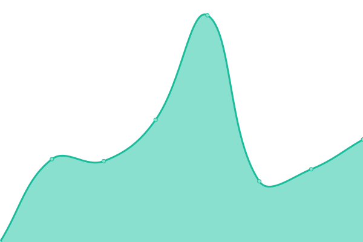 1917ms
     
 | 

<a href="https://dsbaus.github.io/cdr-uptime/history/hiver-bank">100.00%</a>
    

|  [Horizon Bank](https://onlinebanking.horizonbank.com.au/openbanking/cds-au/v1/discovery/status) | 🟩 Up | [horizon-bank.yml](https://github.com/dsbaus/cdr-uptime/commits/HEAD/history/horizon-bank.yml) | 

 948ms
     
 | 

<a href="https://dsbaus.github.io/cdr-uptime/history/horizon-bank">100.00%</a>
    

|  [HSBC](https://public.ob.hsbc.com.au/cds-au/v1/discovery/status) | 🟩 Up | [hsbc.yml](https://github.com/dsbaus/cdr-uptime/commits/HEAD/history/hsbc.yml) | 

 1097ms
     
 | 

<a href="https://dsbaus.github.io/cdr-uptime/history/hsbc">100.00%</a>
    

|  [HSBC Bank Australia Limited – Wholesale Banking](https://public.ob.business.hsbc.com.au/cds-au/v1/discovery/status) | 🟩 Up | [hsbc-bank-australia-limited-wholesale-banking.yml](https://github.com/dsbaus/cdr-uptime/commits/HEAD/history/hsbc-bank-australia-limited-wholesale-banking.yml) | 

 1102ms
     
 | 

<a href="https://dsbaus.github.io/cdr-uptime/history/hsbc-bank-australia-limited-wholesale-banking">100.00%</a>
    

|  [Hume Bank](https://ibankob.humebank.com.au/OpenBanking/cds-au/v1/discovery/status) | 🟩 Up | [hume-bank.yml](https://github.com/dsbaus/cdr-uptime/commits/HEAD/history/hume-bank.yml) | 

 441ms
     
 | 

<a href="https://dsbaus.github.io/cdr-uptime/history/hume-bank">100.00%</a>
    

|  [Humenergy Group](https://cdr.energymadeeasy.gov.au/humenergy/cds-au/v1/energy/plans) | 🟩 Up | [humenergy-group.yml](https://github.com/dsbaus/cdr-uptime/commits/HEAD/history/humenergy-group.yml) | 

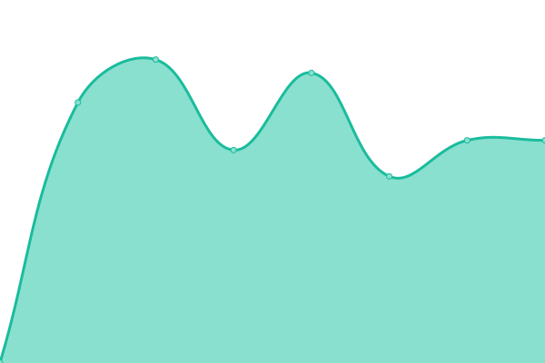 786ms
     
 | 

<a href="https://dsbaus.github.io/cdr-uptime/history/humenergy-group">100.00%</a>
    

|  [iGENO](https://cdr.energymadeeasy.gov.au/igeno/cds-au/v1/energy/plans) | 🟩 Up | [i-geno.yml](https://github.com/dsbaus/cdr-uptime/commits/HEAD/history/i-geno.yml) | 

 609ms
     
 | 

<a href="https://dsbaus.github.io/cdr-uptime/history/i-geno">100.00%</a>
    

|  [Illawarra Credit Union Limited](https://onlineteller.cu.com.au/OpenBanking/cds-au/v1/discovery/status) | 🟩 Up | [illawarra-credit-union-limited.yml](https://github.com/dsbaus/cdr-uptime/commits/HEAD/history/illawarra-credit-union-limited.yml) | 

 1149ms
     
 | 

<a href="https://dsbaus.github.io/cdr-uptime/history/illawarra-credit-union-limited">100.00%</a>
    

|  [IMB Bank](https://openbank.openbanking.imb.com.au/cds-au/v1/discovery/status) | 🟩 Up | [imb-bank.yml](https://github.com/dsbaus/cdr-uptime/commits/HEAD/history/imb-bank.yml) | 

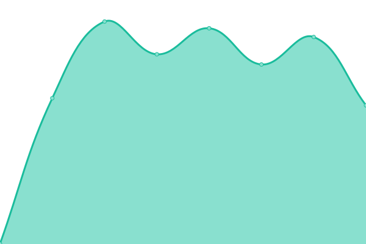 863ms
     
 | 

<a href="https://dsbaus.github.io/cdr-uptime/history/imb-bank">100.00%</a>
    

|  [ING BANK (Australia) Ltd](https://id.ob.ing.com.au/cds-au/v1/discovery/status) | 🟩 Up | [ing-bank-australia-ltd.yml](https://github.com/dsbaus/cdr-uptime/commits/HEAD/history/ing-bank-australia-ltd.yml) | 

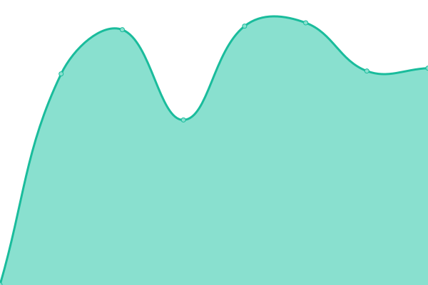 911ms
     
 | 

<a href="https://dsbaus.github.io/cdr-uptime/history/ing-bank-australia-ltd">100.00%</a>
    

|  [Judo Bank](https://public.open.judo.bank/cds-au/v1/discovery/status) | 🟩 Up | [judo-bank.yml](https://github.com/dsbaus/cdr-uptime/commits/HEAD/history/judo-bank.yml) | 

 756ms
     
 | 

<a href="https://dsbaus.github.io/cdr-uptime/history/judo-bank">100.00%</a>
    

|  [Kogan Energy](https://public.cdr.koganenergy.com.au/cds-au/v1/energy/plans) | 🟥 Down | [kogan-energy.yml](https://github.com/dsbaus/cdr-uptime/commits/HEAD/history/kogan-energy.yml) | 

 676ms
     
 | 

<a href="https://dsbaus.github.io/cdr-uptime/history/kogan-energy">100.00%</a>
    

|  [Kogan Money Credit Cards](https://api.openbanking.cards.koganmoney.com.au/cds-au/v1/discovery/status) | 🟩 Up | [kogan-money-credit-cards.yml](https://github.com/dsbaus/cdr-uptime/commits/HEAD/history/kogan-money-credit-cards.yml) | 

 1513ms
     
 | 

<a href="https://dsbaus.github.io/cdr-uptime/history/kogan-money-credit-cards">100.00%</a>
    

|  [Laboratories Credit Union](https://internetbanking.lcu.com.au/OpenBanking/cds-au/v1/discovery/status) | 🟩 Up | [laboratories-credit-union.yml](https://github.com/dsbaus/cdr-uptime/commits/HEAD/history/laboratories-credit-union.yml) | 

 1152ms
     
 | 

<a href="https://dsbaus.github.io/cdr-uptime/history/laboratories-credit-union">100.00%</a>
    

|  [Liberty Financial](https://services.liberty.com.au/api/data-holder-public/cds-au/v1/discovery/status) | 🟩 Up | [liberty-financial.yml](https://github.com/dsbaus/cdr-uptime/commits/HEAD/history/liberty-financial.yml) | 

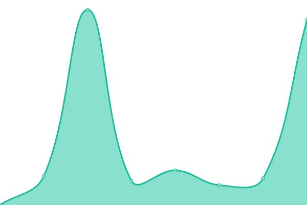 4337ms
     
 | 

<a href="https://dsbaus.github.io/cdr-uptime/history/liberty-financial">100.00%</a>
    

|  [Locality Planning Energy](https://cdr.energymadeeasy.gov.au/locality-planning/cds-au/v1/energy/plans) | 🟩 Up | [locality-planning-energy.yml](https://github.com/dsbaus/cdr-uptime/commits/HEAD/history/locality-planning-energy.yml) | 

 700ms
     
 | 

<a href="https://dsbaus.github.io/cdr-uptime/history/locality-planning-energy">100.00%</a>
    

|  [Localvolts](https://cdr.energymadeeasy.gov.au/localvolts/cds-au/v1/energy/plans) | 🟩 Up | [localvolts.yml](https://github.com/dsbaus/cdr-uptime/commits/HEAD/history/localvolts.yml) | 

 540ms
     
 | 

<a href="https://dsbaus.github.io/cdr-uptime/history/localvolts">100.00%</a>
    

|  [Lumo Energy](https://public.cdr.lumoenergy.com.au/cds-au/v1/energy/plans) | 🟥 Down | [lumo-energy.yml](https://github.com/dsbaus/cdr-uptime/commits/HEAD/history/lumo-energy.yml) | 

 714ms
     
 | 

<a href="https://dsbaus.github.io/cdr-uptime/history/lumo-energy">100.00%</a>
    

|  [Macquarie](https://cdr.energymadeeasy.gov.au/macquarie/cds-au/v1/energy/plans) | 🟩 Up | [macquarie.yml](https://github.com/dsbaus/cdr-uptime/commits/HEAD/history/macquarie.yml) | 

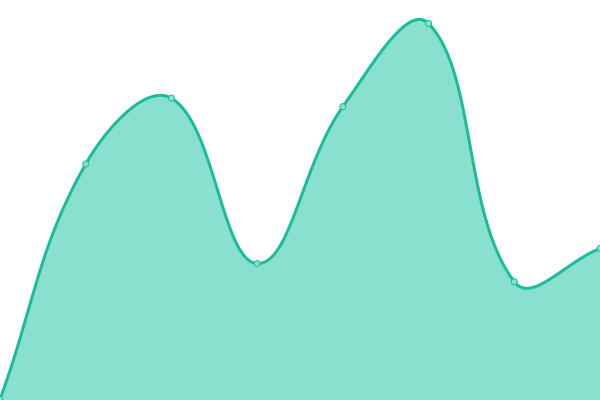 623ms
     
 | 

<a href="https://dsbaus.github.io/cdr-uptime/history/macquarie">100.00%</a>
    

|  [Macquarie Bank Limited](https://api.macquariebank.io/cds-au/v1/discovery/status) | 🟩 Up | [macquarie-bank-limited.yml](https://github.com/dsbaus/cdr-uptime/commits/HEAD/history/macquarie-bank-limited.yml) | 

 918ms
     
 | 

<a href="https://dsbaus.github.io/cdr-uptime/history/macquarie-bank-limited">100.00%</a>
    

|  [Macquarie Credit Union](https://banking.macquariecu.com.au/OpenBanking/cds-au/v1/discovery/status) | 🟥 Down | [macquarie-credit-union.yml](https://github.com/dsbaus/cdr-uptime/commits/HEAD/history/macquarie-credit-union.yml) | 

 255ms
     
 | 

<a href="https://dsbaus.github.io/cdr-uptime/history/macquarie-credit-union">0.00%</a>
    

|  [Maitland Mutual Limited](https://openbanking.themutual.com.au/OpenBanking/cds-au/v1/discovery/status) | 🟩 Up | [maitland-mutual-limited.yml](https://github.com/dsbaus/cdr-uptime/commits/HEAD/history/maitland-mutual-limited.yml) | 

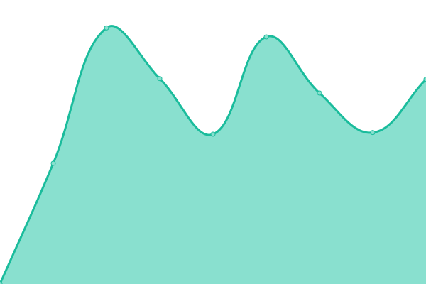 742ms
     
 | 

<a href="https://dsbaus.github.io/cdr-uptime/history/maitland-mutual-limited">100.00%</a>
    

|  [ME Bank](https://public.openbank.mebank.com.au/cds-au/v1/discovery/status) | 🟩 Up | [me-bank.yml](https://github.com/dsbaus/cdr-uptime/commits/HEAD/history/me-bank.yml) | 

 699ms
     
 | 

<a href="https://dsbaus.github.io/cdr-uptime/history/me-bank">100.00%</a>
    

|  [ME Bank - ME Go](https://api.cds.mebank.com.au/cds-au/v1/discovery/status) | 🟩 Up | [me-bank-me-go.yml](https://github.com/dsbaus/cdr-uptime/commits/HEAD/history/me-bank-me-go.yml) | 

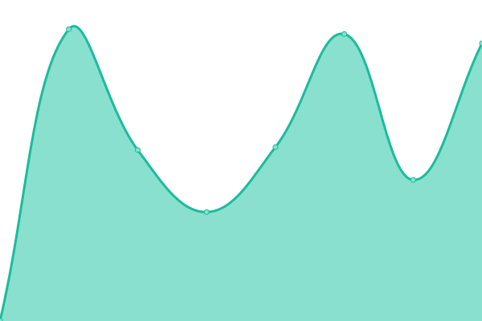 987ms
     
 | 

<a href="https://dsbaus.github.io/cdr-uptime/history/me-bank-me-go">100.00%</a>
    

|  [Metered Energy Holdings Pty Ltd](https://cdr.energymadeeasy.gov.au/metered-energy/cds-au/v1/energy/plans) | 🟩 Up | [metered-energy-holdings-pty-ltd.yml](https://github.com/dsbaus/cdr-uptime/commits/HEAD/history/metered-energy-holdings-pty-ltd.yml) | 

 722ms
     
 | 

<a href="https://dsbaus.github.io/cdr-uptime/history/metered-energy-holdings-pty-ltd">100.00%</a>
    

|  [Microgrid Power](https://cdr.energymadeeasy.gov.au/microgrid/cds-au/v1/energy/plans) | 🟩 Up | [microgrid-power.yml](https://github.com/dsbaus/cdr-uptime/commits/HEAD/history/microgrid-power.yml) | 

 554ms
     
 | 

<a href="https://dsbaus.github.io/cdr-uptime/history/microgrid-power">100.00%</a>
    

|  [Momentum Energy](https://public.cdr.momentumenergy.com.au/cds-au/v1/energy/plans) | 🟥 Down | [momentum-energy.yml](https://github.com/dsbaus/cdr-uptime/commits/HEAD/history/momentum-energy.yml) | 

 799ms
     
 | 

<a href="https://dsbaus.github.io/cdr-uptime/history/momentum-energy">100.00%</a>
    

|  [MOVE Bank](https://openbanking.movebank.com.au/OpenBanking/cds-au/v1/discovery/status) | 🟥 Down | [move-bank.yml](https://github.com/dsbaus/cdr-uptime/commits/HEAD/history/move-bank.yml) | 

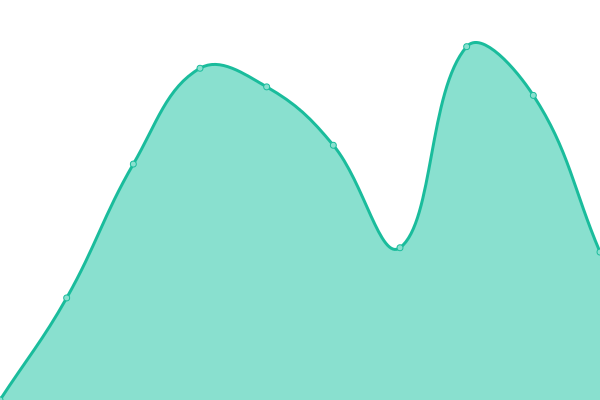 3469ms
     
 | 

<a href="https://dsbaus.github.io/cdr-uptime/history/move-bank">28.52%</a>
    

|  [MyState Bank](https://openbank.api.mystate.com.au/cds-au/v1/discovery/status) | 🟩 Up | [my-state-bank.yml](https://github.com/dsbaus/cdr-uptime/commits/HEAD/history/my-state-bank.yml) | 

 860ms
     
 | 

<a href="https://dsbaus.github.io/cdr-uptime/history/my-state-bank">100.00%</a>
    

|  [NATIONAL AUSTRALIA BANK](https://openbank.api.nab.com.au/cds-au/v1/discovery/status) | 🟩 Up | [national-australia-bank.yml](https://github.com/dsbaus/cdr-uptime/commits/HEAD/history/national-australia-bank.yml) | 

 1565ms
     
 | 

<a href="https://dsbaus.github.io/cdr-uptime/history/national-australia-bank">100.00%</a>
    

|  [Nectr](https://public.cdr.nectr.com.au/cds-au/v1/energy/plans) | 🟥 Down | [nectr.yml](https://github.com/dsbaus/cdr-uptime/commits/HEAD/history/nectr.yml) | 

 761ms
     
 | 

<a href="https://dsbaus.github.io/cdr-uptime/history/nectr">100.00%</a>
    

|  [Newcastle Permanent Building Society](https://openbank.newcastlepermanent.com.au/cds-au/v1/discovery/status) | 🟩 Up | [newcastle-permanent-building-society.yml](https://github.com/dsbaus/cdr-uptime/commits/HEAD/history/newcastle-permanent-building-society.yml) | 

 1219ms
     
 | 

<a href="https://dsbaus.github.io/cdr-uptime/history/newcastle-permanent-building-society">100.00%</a>
    

|  [Next Business Energy](https://public.cdr.nextbusinessenergy.com.au/cds-au/v1/energy/plans) | 🟥 Down | [next-business-energy.yml](https://github.com/dsbaus/cdr-uptime/commits/HEAD/history/next-business-energy.yml) | 

 897ms
     
 | 

<a href="https://dsbaus.github.io/cdr-uptime/history/next-business-energy">100.00%</a>
    

|  [Northern Inland Credit Union Limited](https://secure.nicu.com.au/OpenBanking/cds-au/v1/discovery/status) | 🟩 Up | [northern-inland-credit-union-limited.yml](https://github.com/dsbaus/cdr-uptime/commits/HEAD/history/northern-inland-credit-union-limited.yml) | 

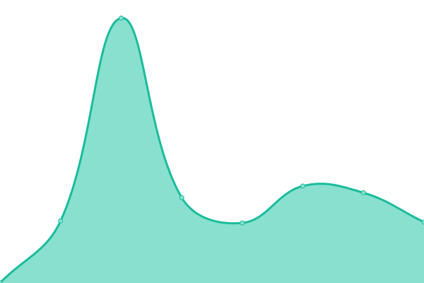 912ms
     
 | 

<a href="https://dsbaus.github.io/cdr-uptime/history/northern-inland-credit-union-limited">100.00%</a>
    

|  [On by EnergyAustralia](https://cdr.energymadeeasy.gov.au/on-by-energyaustralia/cds-au/v1/energy/plans) | 🟩 Up | [on-by-energy-australia.yml](https://github.com/dsbaus/cdr-uptime/commits/HEAD/history/on-by-energy-australia.yml) | 

 859ms
     
 | 

<a href="https://dsbaus.github.io/cdr-uptime/history/on-by-energy-australia">100.00%</a>
    

|  [ORANGE CREDIT UNION LTD](https://online.orangecu.com.au/openbanking/cds-au/v1/discovery/status) | 🟩 Up | [orange-credit-union-ltd.yml](https://github.com/dsbaus/cdr-uptime/commits/HEAD/history/orange-credit-union-ltd.yml) | 

 1211ms
     
 | 

<a href="https://dsbaus.github.io/cdr-uptime/history/orange-credit-union-ltd">100.00%</a>
    

|  [Origin Energy](https://public.mydata.cdr.originenergy.com.au/cds-au/v1/energy/plans) | 🟥 Down | [origin-energy.yml](https://github.com/dsbaus/cdr-uptime/commits/HEAD/history/origin-energy.yml) | 

 611ms
     
 | 

<a href="https://dsbaus.github.io/cdr-uptime/history/origin-energy">100.00%</a>
    

|  [OVO Energy](https://public.cdr.ovoenergy.com.au/cds-au/v1/energy/plans) | 🟥 Down | [ovo-energy.yml](https://github.com/dsbaus/cdr-uptime/commits/HEAD/history/ovo-energy.yml) | 

 729ms
     
 | 

<a href="https://dsbaus.github.io/cdr-uptime/history/ovo-energy">100.00%</a>
    

|  [P&N Bank](https://public.cdr-api.pnbank.com.au/cds-au/v1/discovery/status) | 🟩 Up | [p-and-n-bank.yml](https://github.com/dsbaus/cdr-uptime/commits/HEAD/history/p-and-n-bank.yml) | 

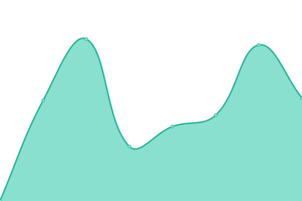 1160ms
     
 | 

<a href="https://dsbaus.github.io/cdr-uptime/history/p-and-n-bank">100.00%</a>
    

|  [Pacific Blue Retail](https://public.cdr.pacificblue.com.au/cds-au/v1/energy/plans) | 🟥 Down | [pacific-blue-retail.yml](https://github.com/dsbaus/cdr-uptime/commits/HEAD/history/pacific-blue-retail.yml) | 

 2447ms
     
 | 

<a href="https://dsbaus.github.io/cdr-uptime/history/pacific-blue-retail">100.00%</a>
    

|  [PayPal Australia](https://api.paypal.com/v1/identity/cds-au/v1/discovery/status) | 🟩 Up | [pay-pal-australia.yml](https://github.com/dsbaus/cdr-uptime/commits/HEAD/history/pay-pal-australia.yml) | 

 257ms
     
 | 

<a href="https://dsbaus.github.io/cdr-uptime/history/pay-pal-australia">100.00%</a>
    

|  [People Energy](https://cdr.energymadeeasy.gov.au/people-energy/cds-au/v1/energy/plans) | 🟩 Up | [people-energy.yml](https://github.com/dsbaus/cdr-uptime/commits/HEAD/history/people-energy.yml) | 

 678ms
     
 | 

<a href="https://dsbaus.github.io/cdr-uptime/history/people-energy">100.00%</a>
    

|  [People's Choice](https://ob-public.peopleschoice.com.au/cds-au/v1/discovery/status) | 🟩 Up | [people-s-choice.yml](https://github.com/dsbaus/cdr-uptime/commits/HEAD/history/people-s-choice.yml) | 

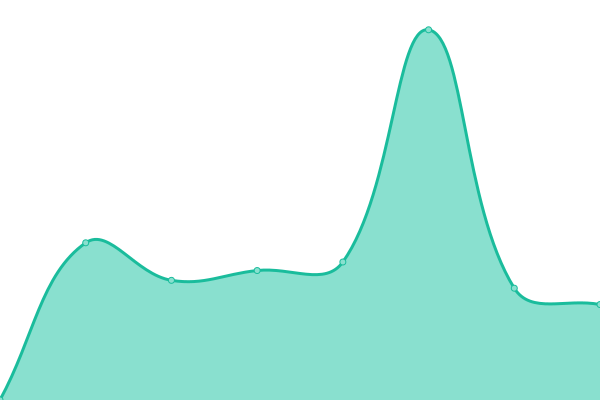 1522ms
     
 | 

<a href="https://dsbaus.github.io/cdr-uptime/history/people-s-choice">100.00%</a>
    

|  [Police Bank](https://product.api.policebank.com.au/cds-au/v1/discovery/status) | 🟩 Up | [police-bank.yml](https://github.com/dsbaus/cdr-uptime/commits/HEAD/history/police-bank.yml) | 

 958ms
     
 | 

<a href="https://dsbaus.github.io/cdr-uptime/history/police-bank">100.00%</a>
    

|  [Police Credit Union Ltd](https://api.policecu.com.au/OpenBanking/cds-au/v1/discovery/status) | 🟩 Up | [police-credit-union-ltd.yml](https://github.com/dsbaus/cdr-uptime/commits/HEAD/history/police-credit-union-ltd.yml) | 

 1185ms
     
 | 

<a href="https://dsbaus.github.io/cdr-uptime/history/police-credit-union-ltd">69.14%</a>
    

|  [Powerdirect](https://cdr.energymadeeasy.gov.au/powerdirect/cds-au/v1/energy/plans) | 🟩 Up | [powerdirect.yml](https://github.com/dsbaus/cdr-uptime/commits/HEAD/history/powerdirect.yml) | 

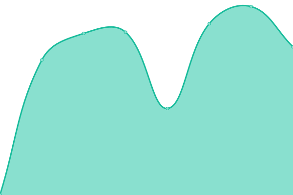 604ms
     
 | 

<a href="https://dsbaus.github.io/cdr-uptime/history/powerdirect">100.00%</a>
    

|  [PowerHub](https://cdr.energymadeeasy.gov.au/powerhub/cds-au/v1/energy/plans) | 🟩 Up | [power-hub.yml](https://github.com/dsbaus/cdr-uptime/commits/HEAD/history/power-hub.yml) | 

 622ms
     
 | 

<a href="https://dsbaus.github.io/cdr-uptime/history/power-hub">100.00%</a>
    

|  [Powershop](https://public.cdr.powershop.com.au/cds-au/v1/energy/plans) | 🟥 Down | [powershop.yml](https://github.com/dsbaus/cdr-uptime/commits/HEAD/history/powershop.yml) | 

 670ms
     
 | 

<a href="https://dsbaus.github.io/cdr-uptime/history/powershop">100.00%</a>
    

|  [Powow Power](https://cdr.energymadeeasy.gov.au/powow/cds-au/v1/energy/plans) | 🟩 Up | [powow-power.yml](https://github.com/dsbaus/cdr-uptime/commits/HEAD/history/powow-power.yml) | 

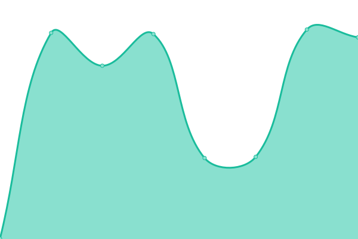 532ms
     
 | 

<a href="https://dsbaus.github.io/cdr-uptime/history/powow-power">100.00%</a>
    

|  [Qantas Premier Credit Cards](https://api.openbanking.qantasmoney.com/cds-au/v1/discovery/status) | 🟩 Up | [qantas-premier-credit-cards.yml](https://github.com/dsbaus/cdr-uptime/commits/HEAD/history/qantas-premier-credit-cards.yml) | 

 2761ms
     
 | 

<a href="https://dsbaus.github.io/cdr-uptime/history/qantas-premier-credit-cards">100.00%</a>
    

|  [QBANK](https://banking.qbank.com.au/openbanking/cds-au/v1/discovery/status) | 🟩 Up | [qbank.yml](https://github.com/dsbaus/cdr-uptime/commits/HEAD/history/qbank.yml) | 

 889ms
     
 | 

<a href="https://dsbaus.github.io/cdr-uptime/history/qbank">100.00%</a>
    

|  [Qudos Bank](https://public.cdr-api.qudosbank.com.au/cds-au/v1/discovery/status) | 🟩 Up | [qudos-bank.yml](https://github.com/dsbaus/cdr-uptime/commits/HEAD/history/qudos-bank.yml) | 

 1711ms
     
 | 

<a href="https://dsbaus.github.io/cdr-uptime/history/qudos-bank">100.00%</a>
    

|  [Queensland Country Bank](https://public.cdr-api.queenslandcountry.bank/cds-au/v1/discovery/status) | 🟩 Up | [queensland-country-bank.yml](https://github.com/dsbaus/cdr-uptime/commits/HEAD/history/queensland-country-bank.yml) | 

 1418ms
     
 | 

<a href="https://dsbaus.github.io/cdr-uptime/history/queensland-country-bank">100.00%</a>
    

|  [Rabobank](https://openbanking.api.rabobank.com.au/public/cds-au/v1/discovery/status) | 🟩 Up | [rabobank.yml](https://github.com/dsbaus/cdr-uptime/commits/HEAD/history/rabobank.yml) | 

 1370ms
     
 | 

<a href="https://dsbaus.github.io/cdr-uptime/history/rabobank">100.00%</a>
    

|  [RACQ Bank](https://cdrbank.racq.com.au/cds-au/v1/discovery/status) | 🟩 Up | [racq-bank.yml](https://github.com/dsbaus/cdr-uptime/commits/HEAD/history/racq-bank.yml) | 

 981ms
     
 | 

<a href="https://dsbaus.github.io/cdr-uptime/history/racq-bank">100.00%</a>
    

|  [Radian Energy](https://cdr.energymadeeasy.gov.au/radian/cds-au/v1/energy/plans) | 🟩 Up | [radian-energy.yml](https://github.com/dsbaus/cdr-uptime/commits/HEAD/history/radian-energy.yml) | 

 704ms
     
 | 

<a href="https://dsbaus.github.io/cdr-uptime/history/radian-energy">100.00%</a>
    

|  [RAMS Financial Group Pty Ltd](https://digital-api.westpac.com.au/rams/cds-au/v1/discovery/status) | 🟩 Up | [rams-financial-group-pty-ltd.yml](https://github.com/dsbaus/cdr-uptime/commits/HEAD/history/rams-financial-group-pty-ltd.yml) | 

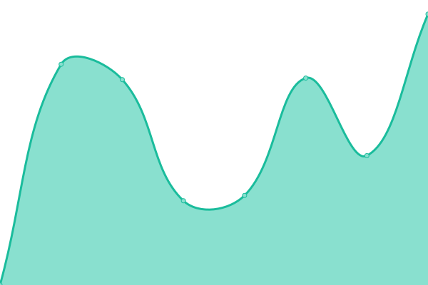 5881ms
     
 | 

<a href="https://dsbaus.github.io/cdr-uptime/history/rams-financial-group-pty-ltd">100.00%</a>
    

|  [Real Utilities](https://cdr.energymadeeasy.gov.au/real-utilities/cds-au/v1/energy/plans) | 🟩 Up | [real-utilities.yml](https://github.com/dsbaus/cdr-uptime/commits/HEAD/history/real-utilities.yml) | 

 537ms
     
 | 

<a href="https://dsbaus.github.io/cdr-uptime/history/real-utilities">100.00%</a>
    

|  [ReAmped Energy](https://cdr.energymadeeasy.gov.au/reamped/cds-au/v1/energy/plans) | 🟩 Up | [re-amped-energy.yml](https://github.com/dsbaus/cdr-uptime/commits/HEAD/history/re-amped-energy.yml) | 

 559ms
     
 | 

<a href="https://dsbaus.github.io/cdr-uptime/history/re-amped-energy">100.00%</a>
    

|  [Red Energy](https://public.cdr.redenergy.com.au/cds-au/v1/energy/plans) | 🟥 Down | [red-energy.yml](https://github.com/dsbaus/cdr-uptime/commits/HEAD/history/red-energy.yml) | 

 664ms
     
 | 

<a href="https://dsbaus.github.io/cdr-uptime/history/red-energy">100.00%</a>
    

|  [Regional Australia Bank](https://public-data.cdr.regaustbank.io/cds-au/v1/discovery/status) | 🟩 Up | [regional-australia-bank.yml](https://github.com/dsbaus/cdr-uptime/commits/HEAD/history/regional-australia-bank.yml) | 

 806ms
     
 | 

<a href="https://dsbaus.github.io/cdr-uptime/history/regional-australia-bank">100.00%</a>
    

|  [Reliance Bank](https://ibanking.reliancebank.com.au/rel-openbanking/cds-au/v1/discovery/status) | 🟩 Up | [reliance-bank.yml](https://github.com/dsbaus/cdr-uptime/commits/HEAD/history/reliance-bank.yml) | 

 956ms
     
 | 

<a href="https://dsbaus.github.io/cdr-uptime/history/reliance-bank">100.00%</a>
    

|  [RSL Money](https://public.open.rslmoney.com.au/cds-au/v1/discovery/status) | 🟩 Up | [rsl-money.yml](https://github.com/dsbaus/cdr-uptime/commits/HEAD/history/rsl-money.yml) | 

 1012ms
     
 | 

<a href="https://dsbaus.github.io/cdr-uptime/history/rsl-money">100.00%</a>
    

|  [Rural Bank](https://api.cdr.ruralbank.com.au/cds-au/v1/discovery/status) | 🟩 Up | [rural-bank.yml](https://github.com/dsbaus/cdr-uptime/commits/HEAD/history/rural-bank.yml) | 

 1020ms
     
 | 

<a href="https://dsbaus.github.io/cdr-uptime/history/rural-bank">100.00%</a>
    

|  [Sanctuary Energy](https://cdr.energymadeeasy.gov.au/sanctuary/cds-au/v1/energy/plans) | 🟩 Up | [sanctuary-energy.yml](https://github.com/dsbaus/cdr-uptime/commits/HEAD/history/sanctuary-energy.yml) | 

 620ms
     
 | 

<a href="https://dsbaus.github.io/cdr-uptime/history/sanctuary-energy">100.00%</a>
    

|  [seene](https://cdr.energymadeeasy.gov.au/seene/cds-au/v1/energy/plans) | 🟩 Up | [seene.yml](https://github.com/dsbaus/cdr-uptime/commits/HEAD/history/seene.yml) | 

 622ms
     
 | 

<a href="https://dsbaus.github.io/cdr-uptime/history/seene">100.00%</a>
    

|  [Shell Energy](https://cdr.energymadeeasy.gov.au/shell-energy/cds-au/v1/energy/plans) | 🟩 Up | [shell-energy.yml](https://github.com/dsbaus/cdr-uptime/commits/HEAD/history/shell-energy.yml) | 

 602ms
     
 | 

<a href="https://dsbaus.github.io/cdr-uptime/history/shell-energy">100.00%</a>
    

|  [Smart Energy](https://cdr.energymadeeasy.gov.au/smart-energy/cds-au/v1/energy/plans) | 🟩 Up | [smart-energy.yml](https://github.com/dsbaus/cdr-uptime/commits/HEAD/history/smart-energy.yml) | 

 605ms
     
 | 

<a href="https://dsbaus.github.io/cdr-uptime/history/smart-energy">100.00%</a>
    

|  [SmartestEnergy](https://cdr.energymadeeasy.gov.au/smartestenergy/cds-au/v1/energy/plans) | 🟩 Up | [smartest-energy.yml](https://github.com/dsbaus/cdr-uptime/commits/HEAD/history/smartest-energy.yml) | 

 509ms
     
 | 

<a href="https://dsbaus.github.io/cdr-uptime/history/smartest-energy">100.00%</a>
    

|  [Sonnen](https://cdr.energymadeeasy.gov.au/sonnen/cds-au/v1/energy/plans) | 🟩 Up | [sonnen.yml](https://github.com/dsbaus/cdr-uptime/commits/HEAD/history/sonnen.yml) | 

 511ms
     
 | 

<a href="https://dsbaus.github.io/cdr-uptime/history/sonnen">100.00%</a>
    

|  [South West Slopes Credit Union Ltd](https://online.swscu.com.au/openbanking/cds-au/v1/discovery/status) | 🟩 Up | [south-west-slopes-credit-union-ltd.yml](https://github.com/dsbaus/cdr-uptime/commits/HEAD/history/south-west-slopes-credit-union-ltd.yml) | 

 1121ms
     
 | 

<a href="https://dsbaus.github.io/cdr-uptime/history/south-west-slopes-credit-union-ltd">100.00%</a>
    

|  [Southern Cross Credit Union](https://cdr.sccu.com.au/openbanking/cds-au/v1/discovery/status) | 🟩 Up | [southern-cross-credit-union.yml](https://github.com/dsbaus/cdr-uptime/commits/HEAD/history/southern-cross-credit-union.yml) | 

 760ms
     
 | 

<a href="https://dsbaus.github.io/cdr-uptime/history/southern-cross-credit-union">100.00%</a>
    

|  [St.George Bank](https://digital-api.stgeorge.com.au/cds-au/v1/discovery/status) | 🟩 Up | [st-george-bank.yml](https://github.com/dsbaus/cdr-uptime/commits/HEAD/history/st-george-bank.yml) | 

 5143ms
     
 | 

<a href="https://dsbaus.github.io/cdr-uptime/history/st-george-bank">100.00%</a>
    

|  [Stanwell Energy](https://cdr.energymadeeasy.gov.au/stanwell/cds-au/v1/energy/plans) | 🟩 Up | [stanwell-energy.yml](https://github.com/dsbaus/cdr-uptime/commits/HEAD/history/stanwell-energy.yml) | 

 597ms
     
 | 

<a href="https://dsbaus.github.io/cdr-uptime/history/stanwell-energy">100.00%</a>
    

|  [Summerland Bank](https://public.cdr-api.summerland.com.au/cds-au/v1/discovery/status) | 🟩 Up | [summerland-bank.yml](https://github.com/dsbaus/cdr-uptime/commits/HEAD/history/summerland-bank.yml) | 

 1083ms
     
 | 

<a href="https://dsbaus.github.io/cdr-uptime/history/summerland-bank">100.00%</a>
    

|  [Sumo](https://cdr.energymadeeasy.gov.au/sumo-gas/cds-au/v1/energy/plans) | 🟩 Up | [sumo.yml](https://github.com/dsbaus/cdr-uptime/commits/HEAD/history/sumo.yml) | 

 769ms
     
 | 

<a href="https://dsbaus.github.io/cdr-uptime/history/sumo">100.00%</a>
    

|  [Sumo Power](https://public-cdr-sumo.bravecloud.com/m8k36eqyhrvhqxeeic/public/cds-au/v1/energy/plans) | 🟥 Down | [sumo-power.yml](https://github.com/dsbaus/cdr-uptime/commits/HEAD/history/sumo-power.yml) | 

 1111ms
     
 | 

<a href="https://dsbaus.github.io/cdr-uptime/history/sumo-power">100.00%</a>
    

|  [Suncorp Bank](https://id-ob.suncorpbank.com.au/cds-au/v1/discovery/status) | 🟩 Up | [suncorp-bank.yml](https://github.com/dsbaus/cdr-uptime/commits/HEAD/history/suncorp-bank.yml) | 

 860ms
     
 | 

<a href="https://dsbaus.github.io/cdr-uptime/history/suncorp-bank">100.00%</a>
    

|  [Tango Energy](https://public.cdr.tangoenergy.com/cds-au/v1/energy/plans) | 🟥 Down | [tango-energy.yml](https://github.com/dsbaus/cdr-uptime/commits/HEAD/history/tango-energy.yml) | 

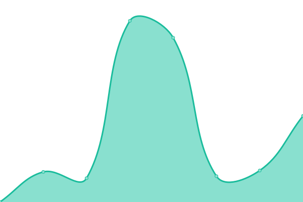 1372ms
     
 | 

<a href="https://dsbaus.github.io/cdr-uptime/history/tango-energy">100.00%</a>
    

|  [Tas Gas](https://cdr.energymadeeasy.gov.au/tas-gas/cds-au/v1/energy/plans) | 🟩 Up | [tas-gas.yml](https://github.com/dsbaus/cdr-uptime/commits/HEAD/history/tas-gas.yml) | 

 544ms
     
 | 

<a href="https://dsbaus.github.io/cdr-uptime/history/tas-gas">100.00%</a>
    

|  [Teachers Mutual Bank](https://ob.tmbl.com.au/tmbank/cds-au/v1/discovery/status) | 🟩 Up | [teachers-mutual-bank.yml](https://github.com/dsbaus/cdr-uptime/commits/HEAD/history/teachers-mutual-bank.yml) | 

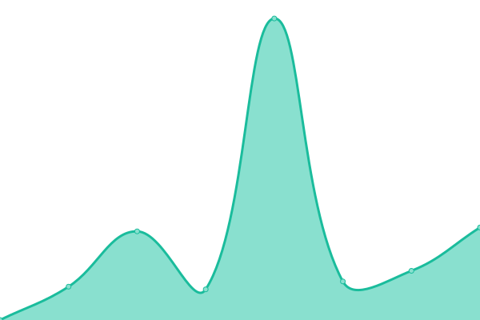 2317ms
     
 | 

<a href="https://dsbaus.github.io/cdr-uptime/history/teachers-mutual-bank">100.00%</a>
    

|  [Telstra Energy](https://cdr.energymadeeasy.gov.au/telstra-energy/cds-au/v1/energy/plans) | 🟩 Up | [telstra-energy.yml](https://github.com/dsbaus/cdr-uptime/commits/HEAD/history/telstra-energy.yml) | 

 605ms
     
 | 

<a href="https://dsbaus.github.io/cdr-uptime/history/telstra-energy">100.00%</a>
    

|  [The Capricornian](https://public.cdr.onlinebanking.capricornian.com.au/cds-au/v1/discovery/status) | 🟩 Up | [the-capricornian.yml](https://github.com/dsbaus/cdr-uptime/commits/HEAD/history/the-capricornian.yml) | 

 765ms
     
 | 

<a href="https://dsbaus.github.io/cdr-uptime/history/the-capricornian">100.00%</a>
    

|  [The Mac](https://onlinebanking.themaccu.com.au/OpenBanking/cds-au/v1/discovery/status) | 🟩 Up | [the-mac.yml](https://github.com/dsbaus/cdr-uptime/commits/HEAD/history/the-mac.yml) | 

 1123ms
     
 | 

<a href="https://dsbaus.github.io/cdr-uptime/history/the-mac">100.00%</a>
    

|  [Thriday](https://public.cdr.thriday.com.au/cds-au/v1/discovery/status) | 🟩 Up | [thriday.yml](https://github.com/dsbaus/cdr-uptime/commits/HEAD/history/thriday.yml) | 

 700ms
     
 | 

<a href="https://dsbaus.github.io/cdr-uptime/history/thriday">100.00%</a>
    

|  [TMCU](https://banking.transportmutual.com.au/OpenBanking/cds-au/v1/discovery/status) | 🟩 Up | [tmcu.yml](https://github.com/dsbaus/cdr-uptime/commits/HEAD/history/tmcu.yml) | 

 1061ms
     
 | 

<a href="https://dsbaus.github.io/cdr-uptime/history/tmcu">100.00%</a>
    

|  [Traditional Credit Union](https://prd.tcu.com.au/cds-au/v1/discovery/status) | 🟩 Up | [traditional-credit-union.yml](https://github.com/dsbaus/cdr-uptime/commits/HEAD/history/traditional-credit-union.yml) | 

 1673ms
     
 | 

<a href="https://dsbaus.github.io/cdr-uptime/history/traditional-credit-union">100.00%</a>
    

|  [Tyro Payments](https://public.cdr.tyro.com/cds-au/v1/discovery/status) | 🟩 Up | [tyro-payments.yml](https://github.com/dsbaus/cdr-uptime/commits/HEAD/history/tyro-payments.yml) | 

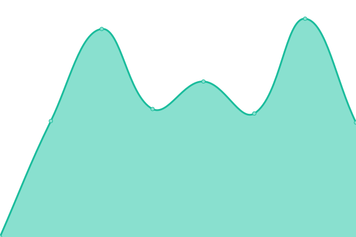 1071ms
     
 | 

<a href="https://dsbaus.github.io/cdr-uptime/history/tyro-payments">100.00%</a>
    

|  [UBank](https://public.cdr-api.86400.com.au/cds-au/v1/discovery/status) | 🟩 Up | [u-bank.yml](https://github.com/dsbaus/cdr-uptime/commits/HEAD/history/u-bank.yml) | 

 1050ms
     
 | 

<a href="https://dsbaus.github.io/cdr-uptime/history/u-bank">100.00%</a>
    

|  [UniBank](https://ob.tmbl.com.au/unibank/cds-au/v1/discovery/status) | 🟩 Up | [uni-bank.yml](https://github.com/dsbaus/cdr-uptime/commits/HEAD/history/uni-bank.yml) | 

 2252ms
     
 | 

<a href="https://dsbaus.github.io/cdr-uptime/history/uni-bank">100.00%</a>
    

|  [Unity Bank](https://ibanking.unitybank.com.au/OpenBanking/cds-au/v1/discovery/status) | 🟩 Up | [unity-bank.yml](https://github.com/dsbaus/cdr-uptime/commits/HEAD/history/unity-bank.yml) | 

 961ms
     
 | 

<a href="https://dsbaus.github.io/cdr-uptime/history/unity-bank">100.00%</a>
    

|  [Unloan](https://public.api.cdr.unloan.com.au/cds-au/v1/discovery/status) | 🟩 Up | [unloan.yml](https://github.com/dsbaus/cdr-uptime/commits/HEAD/history/unloan.yml) | 

 701ms
     
 | 

<a href="https://dsbaus.github.io/cdr-uptime/history/unloan">100.00%</a>
    

|  [Up](https://api.up.com.au/cds-au/v1/discovery/status) | 🟩 Up | [up.yml](https://github.com/dsbaus/cdr-uptime/commits/HEAD/history/up.yml) | 

 805ms
     
 | 

<a href="https://dsbaus.github.io/cdr-uptime/history/up">100.00%</a>
    

|  [Virgin Money](https://api.cds.virginmoney.com.au/cds-au/v1/discovery/status) | 🟩 Up | [virgin-money.yml](https://github.com/dsbaus/cdr-uptime/commits/HEAD/history/virgin-money.yml) | 

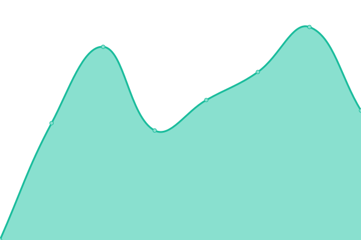 987ms
     
 | 

<a href="https://dsbaus.github.io/cdr-uptime/history/virgin-money">100.00%</a>
    

|  [Warwick Credit Union Ltd](https://openbanking.wcu.com.au/OpenBanking/cds-au/v1/discovery/status) | 🟩 Up | [warwick-credit-union-ltd.yml](https://github.com/dsbaus/cdr-uptime/commits/HEAD/history/warwick-credit-union-ltd.yml) | 

 847ms
     
 | 

<a href="https://dsbaus.github.io/cdr-uptime/history/warwick-credit-union-ltd">97.75%</a>
    

|  [Westpac](https://digital-api.westpac.com.au/cds-au/v1/discovery/status) | 🟩 Up | [westpac.yml](https://github.com/dsbaus/cdr-uptime/commits/HEAD/history/westpac.yml) | 

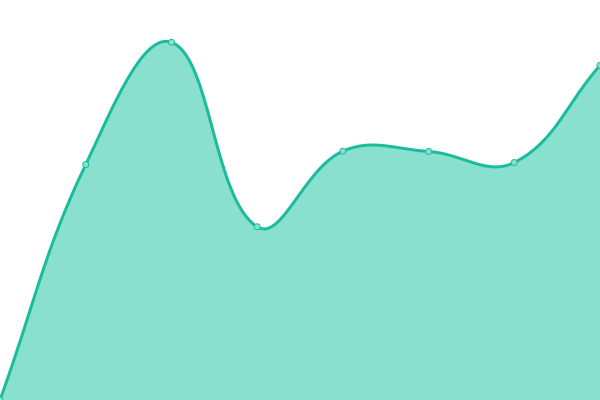 4196ms
     
 | 

<a href="https://dsbaus.github.io/cdr-uptime/history/westpac">100.00%</a>
    

|  [WinConnect](https://cdr.energymadeeasy.gov.au/winconnect/cds-au/v1/energy/plans) | 🟩 Up | [win-connect.yml](https://github.com/dsbaus/cdr-uptime/commits/HEAD/history/win-connect.yml) | 

 695ms
     
 | 

<a href="https://dsbaus.github.io/cdr-uptime/history/win-connect">100.00%</a>
    

|  [Wise](https://au-cdrbanking-pub.wise.com/cds-au/v1/discovery/status) | 🟩 Up | [wise.yml](https://github.com/dsbaus/cdr-uptime/commits/HEAD/history/wise.yml) | 

 264ms
     
 | 

<a href="https://dsbaus.github.io/cdr-uptime/history/wise">100.00%</a>
    

|  [Woolworths Team Bank](https://online.woolworthsteambank.com.au/OpenBanking/cds-au/v1/discovery/status) | 🟩 Up | [woolworths-team-bank.yml](https://github.com/dsbaus/cdr-uptime/commits/HEAD/history/woolworths-team-bank.yml) | 

 1303ms
     
 | 

<a href="https://dsbaus.github.io/cdr-uptime/history/woolworths-team-bank">100.00%</a>
    

|  [YES Energy](https://cdr.energymadeeasy.gov.au/yes-energy/cds-au/v1/energy/plans) | 🟩 Up | [yes-energy.yml](https://github.com/dsbaus/cdr-uptime/commits/HEAD/history/yes-energy.yml) | 

 609ms
     
 | 

<a href="https://dsbaus.github.io/cdr-uptime/history/yes-energy">100.00%</a>
    

|  [ZEN Energy](https://cdr.energymadeeasy.gov.au/zen-energy/cds-au/v1/energy/plans) | 🟩 Up | [zen-energy.yml](https://github.com/dsbaus/cdr-uptime/commits/HEAD/history/zen-energy.yml) | 

 606ms
     
 | 

<a href="https://dsbaus.github.io/cdr-uptime/history/zen-energy">100.00%</a>
    

<!--end: status pages-->

[**Visit our status website →**](https://dsbaus.github.io/cdr-uptime)

## 📄 License

- Powered by: [Upptime](https://github.com/upptime/upptime)
- Code: [MIT](./LICENSE) © [Data Standards Body, Australia](https://consumerdatastandards.gov.au)
- Data in the `./history` directory: [Open Database License](https://opendatacommons.org/licenses/odbl/1-0/)
